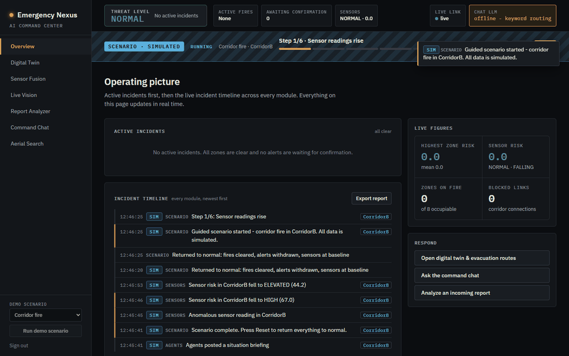
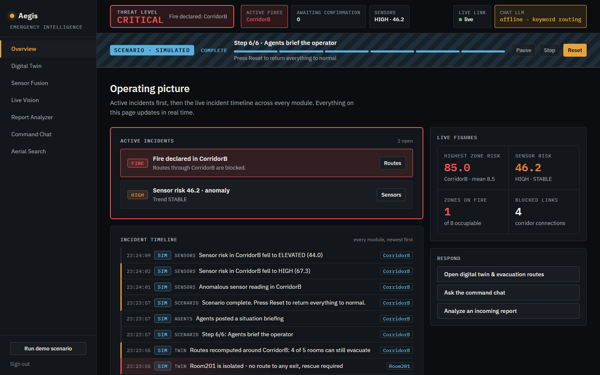
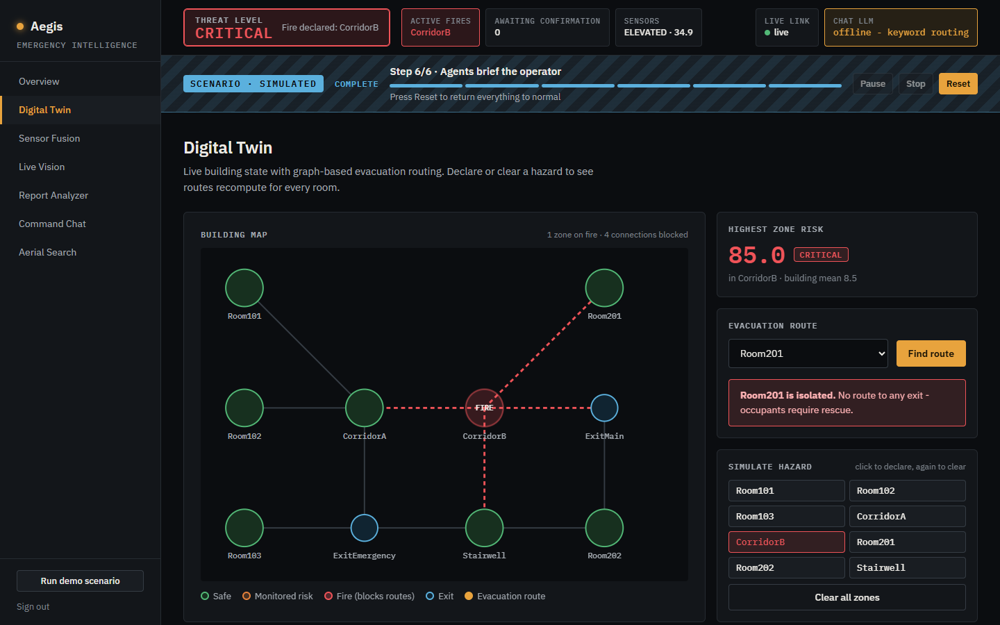
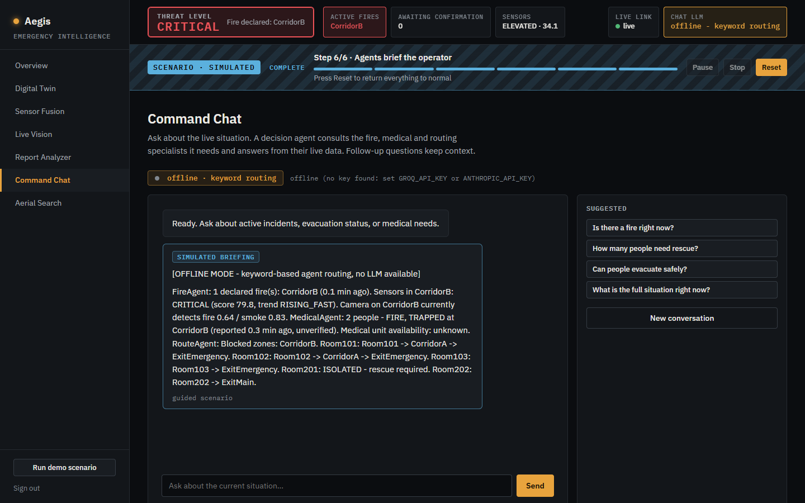
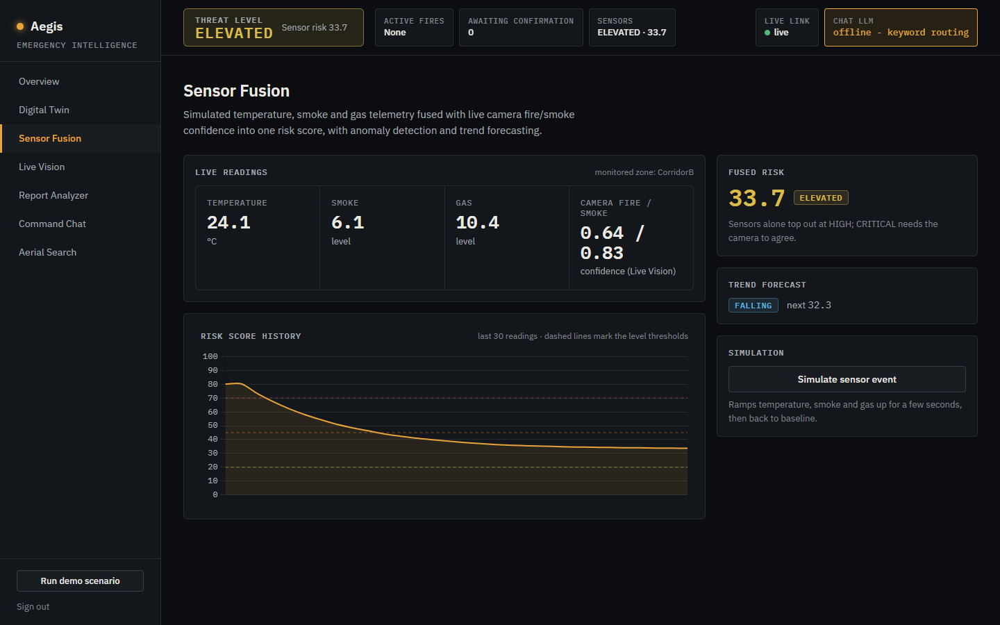
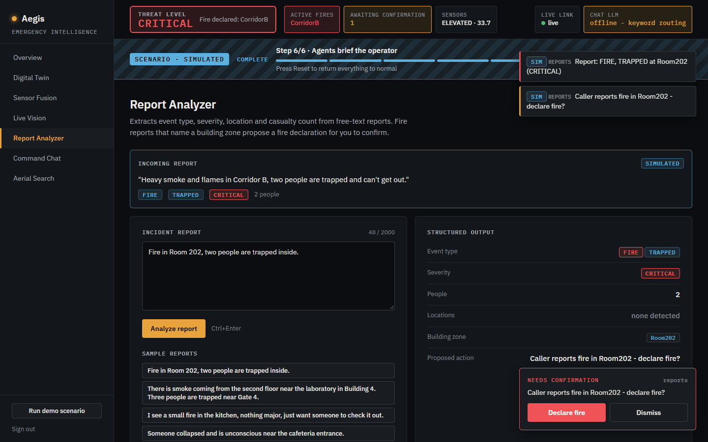
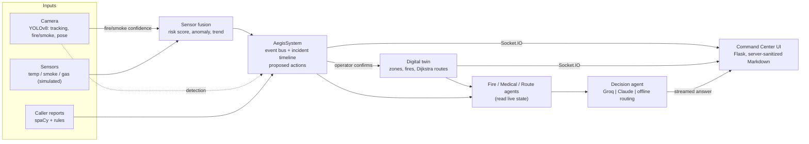

# AegisAI
### Multimodal emergency intelligence for buildings - detection, fusion, evacuation routing and an agent-driven command chat

[](https://github.com/Aziz-ahmad555/AegisAI/actions/workflows/ci.yml)

**Live demo: https://aegisai-9aki.onrender.com**
*Hosted on Render's free tier - if it has been idle, the first load can take up to a minute while it wakes up. Demo login available on request. The hosted version has no camera, so Live Vision is local-only; everything else, including the guided scenario, works.*

AegisAI is a command center that reasons across several signals at once, the way a real campus or smart-building control room would: camera fire/smoke detection, IoT-style sensor telemetry, free-text caller reports and a live digital twin of the building. Evidence is fused into a risk picture, the system *proposes* actions (a human confirms them), evacuation routes recompute around hazards, and a decision agent answers operator questions from live data.



*The guided demo scenario (every step is labelled SIMULATED). Recorded in offline mode - no LLM key needed.*

---

## Contents

- [What it does](#what-it-does)
- [Architecture](#architecture)
- [What's real and what's simulated](#whats-real-and-whats-simulated)
- [Run it locally](#run-it-locally)
- [Deploy it (free)](#deploy-it-free)
- [Configuration](#configuration)
- [Security](#security)
- [Testing and CI](#testing-and-ci)
- [Known limitations](#known-limitations)
- [Engineering findings](#engineering-findings)
- [Project structure](#project-structure)

---

## What it does

| | |
|---|---|
| **Operating picture** - one threat level for the building (always on screen), active incidents first, and a live incident timeline across every module. |  |
| **Digital twin** - the building as a graph; declared fires block connections and Dijkstra routing recomputes an exit for every room, flagging rooms that must leave through their own hazard zone and rooms that are fully isolated. |  |
| **Command chat** - a decision agent (Groq or Claude, with an offline fallback) consults Fire, Medical and Route agents that read live state, and answers with what the data shows - unknowns stay unknown, caller text is treated as untrusted. |  |
| **Sensor fusion** - temperature, smoke and gas readings fused with camera confidence into one 0-100 risk score, with z-score anomaly detection and trend forecasting. Sensors alone top out at HIGH; CRITICAL needs the camera to agree. |  |
| **Report analyzer** - spaCy entities plus domain rules extract event type, severity (incl. downplayed language), people counts and locations; a fire report that names a zone proposes a fire declaration. |  |

Also: **Live Vision** (local only - YOLOv8 tracking, the custom fire/smoke model and pose-based fall detection on a webcam, ~120 ms camera-to-screen) and **Aerial Search** (pose classification on search-and-rescue drone imagery).

**Human in the loop.** Automated evidence - a camera detection, CRITICAL sensors, a caller's report - only ever *proposes* "declare fire?". An operator confirms or dismisses it; the guided scenario auto-confirms after a visible countdown, and says so.

---

## Architecture



- **`aegis_core/`** - the domain logic as an installable package: twin and routing, sensor simulation and fusion, anomaly and trend detection, emergency NLP, the event bus that ties modules together, the agents and LLM coordinator, the vision pipeline and the guided scenario.
- **`command_center/`** - the Flask + Socket.IO web app on top of it: auth, CSRF, rate limiting, the pages, and the tests.
- One process holds the live state in memory, so it runs as **one** gunicorn worker (threaded) - see [ROADMAP.md](ROADMAP.md#production-server-decision-2026-09-24).

---

## What's real and what's simulated

| Part | Status | Detail |
|---|---|---|
| Fire/smoke detection | **Real model** | Custom YOLOv8n, mAP50 0.576, trained on a public dataset (CPU). Runs on a live webcam locally. |
| Object tracking, fall detection | **Real models** | YOLOv8n / YOLOv8n-pose on the live webcam (local only). |
| Aerial pose detection | **Real model, static images** | Custom YOLOv8n on SARD (mAP50 0.572, recall 0.512). No drone - held-out test photos. |
| Report parsing | **Real** | spaCy NER + rule engine on whatever text you type. |
| Evacuation routing | **Real algorithm, modelled building** | Dijkstra over a 10-zone graph of a fictional building. |
| Sensor telemetry | **Simulated** | A simulator with realistic ramping; the fusion, anomaly and trend logic on top of it is real. |
| Chat answers | **Real LLM** (Groq / Claude) or **offline** | Agents read live system state; offline mode is keyword routing over the same agents. |
| Guided scenario | **Scripted inputs, real pipeline** | Sensor ramp, camera confidence and the caller report are scripted; everything downstream is the normal code path. Always labelled **SCENARIO / SIMULATED**. |
| Hosted demo | **No camera** | Cloud mode hides Live Vision; everything else works. |

---

## Run it locally

Windows / PowerShell shown; macOS/Linux use `source venv/bin/activate`.

```powershell
git clone https://github.com/Aziz-ahmad555/AegisAI.git
cd AegisAI\command_center
python -m venv venv
venv\Scripts\activate
pip install -r requirements.txt
pip install -e ..
python app.py
```

Open http://127.0.0.1:5000 and sign in with **operator / aegisai2026** (local demo default). Then press **Run demo scenario** in the sidebar.

Live Vision needs the trained fire/smoke weights copied into `command_center/` as `fire_smoke_model.pt` (weights aren't committed - see [Model weights](#model-weights)); the other pages work without them.

### Free LLM for the command chat (Groq)

1. Create a free key at https://console.groq.com/keys.
2. Set it in the terminal you start the app from - in **single quotes**, and never paste it anywhere else:
   ```powershell
   $env:GROQ_API_KEY = 'gsk_...'
   ```
3. Start the app. The first line tells you which LLM is active, e.g. `LLM: groq / openai/gpt-oss-120b (auto-selected: available to this key)`; if the key is rejected it says so and the chat runs offline. The app picks a tool-capable Groq model your key can actually use.

Without a key the chat still works in **offline mode** (keyword routing over the same agents). Claude is also supported: set `ANTHROPIC_API_KEY` (default model `claude-sonnet-5`), or force a provider with `AEGISAI_LLM_PROVIDER=groq|claude|offline`.

### Your own password

Only a hash is stored. Generate it (you're prompted; nothing is echoed):
```powershell
python -c "import getpass; from werkzeug.security import generate_password_hash as h; print(h(getpass.getpass()))"
```
and set the output, in single quotes because it contains `$`: `$env:AEGISAI_PASSWORD_HASH = 'scrypt:...'`.

---

## Deploy it (free)

The repo ships a `Dockerfile` (cloud mode: no camera stack, gunicorn threaded worker, non-root user, health check) and a Render blueprint (`render.yaml`).

**Render (free web service):**
1. Push the repo to GitHub, then in Render: **New + → Blueprint** → pick the repo.
2. Render generates `AEGISAI_SECRET_KEY`. Fill in `AEGISAI_PASSWORD_HASH` (command above) and, optionally, `GROQ_API_KEY`.
3. Deploy. The free tier sleeps when idle; the first request after a sleep takes a while.

**Any Docker host:**
```bash
docker build -t aegisai .
docker run -p 8000:8000 -e AEGISAI_SECRET_KEY=<64 hex chars> -e AEGISAI_PASSWORD_HASH='<hash>' -e GROQ_API_KEY='<optional>' aegisai
```

Cloud mode **refuses to start** without a real `AEGISAI_SECRET_KEY` (32+ characters; `python -c "import secrets; print(secrets.token_hex(32))"`) and an `AEGISAI_PASSWORD_HASH`, and names what's missing.

---

## Configuration

All settings are environment variables; `command_center/.env.example` documents each one.

| Variable | Default | Purpose |
|---|---|---|
| `AEGISAI_PASSWORD_HASH` / `AEGISAI_USERNAME` | demo login | Operator credentials (hash required in cloud mode) |
| `AEGISAI_SECRET_KEY` | demo key | Session signing (required in cloud mode) |
| `AEGISAI_CLOUD_MODE` | `false` | Hosted mode: no camera, secure cookies, strict startup checks |
| `AEGISAI_TRUST_PROXY` | `false` | Use the real client IP behind a hosting proxy (rate limiting) |
| `GROQ_API_KEY` / `ANTHROPIC_API_KEY` | - | Chat LLM keys |
| `AEGISAI_LLM_PROVIDER` | auto | `groq`, `claude` or `offline` |
| `AEGISAI_GROQ_MODEL` / `AEGISAI_CLAUDE_MODEL` | auto / `claude-sonnet-5` | Pin a model |
| `AEGISAI_SENSOR_ZONE` / `AEGISAI_CAMERA_ZONE` | `CorridorB` / `Room201` | Zones the sensors and camera watch |
| `AEGISAI_SCENARIO_COUNTDOWN` | `10` | Seconds before the scenario auto-confirms |
| `AEGISAI_TRACK_CONF` / `AEGISAI_INFER_SIZE` / `AEGISAI_TRACK_MODEL` | `0.25` / `320` / `yolov8n.pt` | Live Vision tuning (chosen from a measured phone-detection test) |

---

## Security

- Hashed operator password, constant-time checks, session reset on login, login rate limiting (5 failures / 5 min per client).
- CSRF tokens on every POST; Socket.IO accepts same-origin connections only and refuses unauthenticated handshakes.
- A Content-Security-Policy with **no third-party origins** - every script, stylesheet and font is self-hosted.
- LLM output is untrusted: Markdown is rendered **server-side** with raw HTML disabled, then sanitized with an allowlist (no scripts, handlers, styles or images; safe links only). Tested against 19 XSS payloads and in a real browser.
- Caller text reaches the LLM only in fields marked `_untrusted`, and the prompt forbids following instructions inside them.
- Keys are never logged; anything key-shaped is redacted from error messages and tracebacks.

---

## Testing and CI

```powershell
pip install -r command_center/requirements-dev.txt
python -m pytest          # from the repo root - 255 tests
ruff check aegis_core command_center
```

GitHub Actions runs ruff and the full suite on every push, using the cloud requirement set (no camera or GPU stack). The tests use fake LLM clients - no network, no keys.

---

## Known limitations

- **Single building, single process.** One modelled building; live state lives in memory, so it runs as one worker and resets on restart. Multi-site or multi-worker would need Redis and persistent storage.
- **Simulated sensors.** Telemetry comes from a simulator, not real hardware.
- **Model accuracy.** Fire/smoke mAP50 is 0.576 and weaker in low light (daylight-skewed training data). Aerial recall is 0.512 - it misses about half the people, so treat detections as leads, not counts.
- **Fall detection** needs the full body in frame; a desk-height laptop webcam often can't see the hips.
- **Offline chat** is keyword routing - it answers from the right agents but can't reason across a nuanced question the way the LLM does.
- **Free hosting** sleeps when idle, and there's no camera there.
- **Not a certified safety system.** A portfolio project that demonstrates the architecture; it is not a replacement for a fire alarm system.

---

## Engineering findings

- **The live-vision lag was the server, not the model.** `eventlet` ran every thread as a green thread on one OS thread, so each ~200 ms YOLO inference froze the video stream, WebSocket and page loads, while buffered webcam frames piled up into 5-10 s of latency. Real threads plus a newest-frame-only grabber took it to ~120 ms.
- **"Building risk" must not be an average.** One fire among ten zones averaged to a green "normal"; the UI now headlines the worst zone.
- **Multimodal fusion reduces false confidence.** Camera-only detections are capped at moderate risk by design; only agreement between camera and sensors reaches CRITICAL.
- **Evacuation logic needs three outcomes, not two.** A room on fire can still leave through its own door (flagged), versus rooms that are genuinely isolated.
- **Bugs caught by testing in a real browser that unit tests couldn't:** a script-load-order bug that silently stopped evacuation routes from rendering, and an unauthenticated socket that stayed connected under a real server.
- **Model availability is per account.** A hard-coded Groq model returned 404 for a real key; the app now asks the provider which models the key can use.
- **Low-light / framing limits** of the detectors were measured, not assumed (per-keypoint confidence logging, a phone-in-hand capture to pick tracking thresholds).

### Model weights

Weights (`.pt`) aren't committed. They're reproducible from the dataset and training commands in [`archive/phases/`](archive/phases/README.md#running-an-individual-phase) (about 1-1.5 h each on a CPU laptop). The recorded metrics act as a lightweight model registry - see `archive/phases/phase11_multiagent_mlops_security/MLOPS.md`.

---

## Project structure

```
AegisAI/
  aegis_core/          domain logic (installable): twin + routing, fusion, NLP, event bus,
                       agents + LLM coordinator, vision pipeline, guided scenario
  command_center/      Flask + Socket.IO app: templates, static (design system, vendored libs),
                       tests (255), tools (detection diagnostic)
  archive/phases/      how it was built: 11 phase snapshots, per-phase instructions, training pipelines
  docs/images/         README screenshots and the scenario GIF
  Dockerfile, render.yaml, ROADMAP.md
```

Built phase by phase - from a webcam detection script to a connected multimodal system; the full history is in [archive/phases](archive/phases/README.md) and the ongoing plan in [ROADMAP.md](ROADMAP.md).
